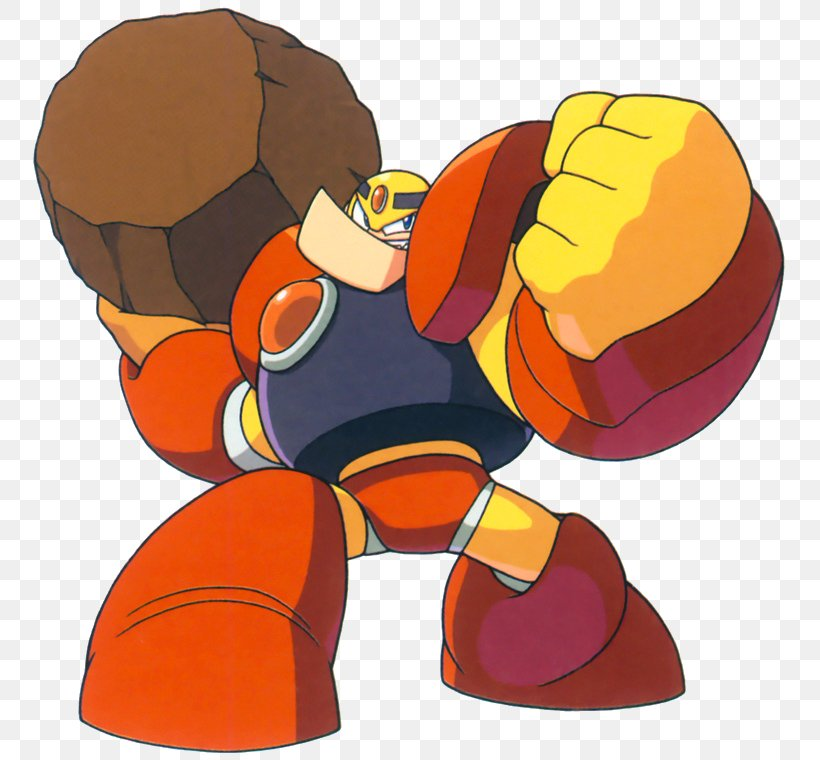
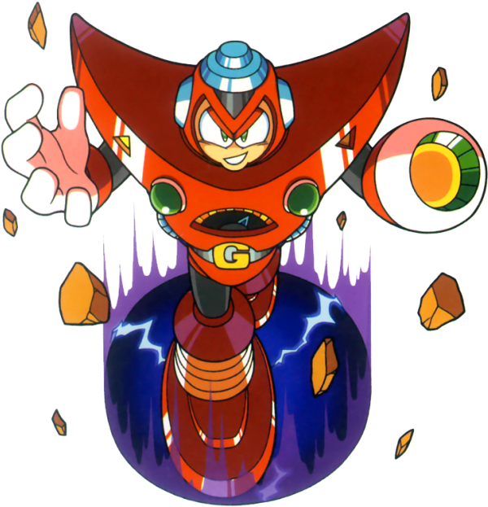
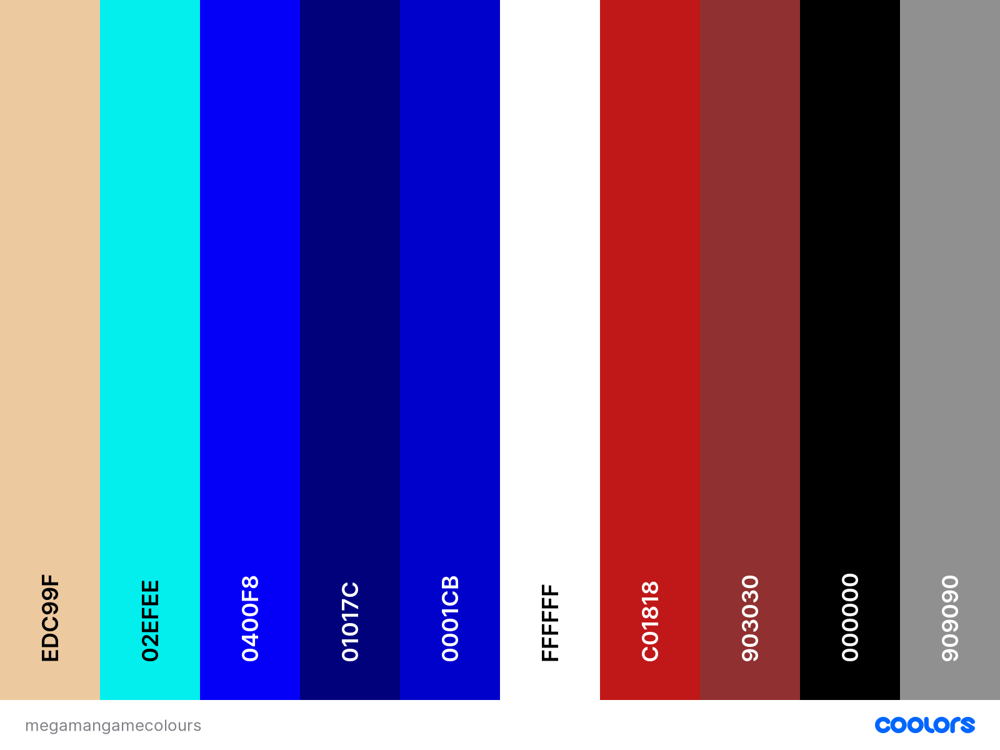
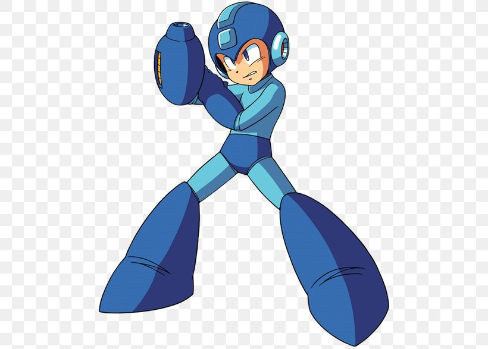
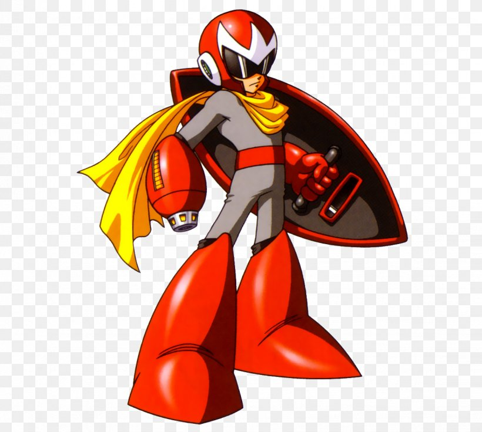

# Mega Man Memory Game
There's been a lot of debating and ideas for considering my Second project. After considering my options, I decided to create a memory game inspired from one of my favourite [Capcom](http://www.capcom-europe.com/) game franchise called "Mega Man," which is known as "Rockman" in Japan. 

The First time I played the Mega Man 1, I was very addicted to the game, as I found it very entertaining, and the challenges on every stages of the game was worth playing it. 

The younger me always looked forward to the succeeding Mega Man game series. What I found interesting with the game is the theme of every robot bosses and their special powers. 

I put a lot of inspiration creating this memory game. Whether you're a fan of Mega Man or have just heard of Mega Man, I hope this game entertains you! 

# UX 

## Project Goals

I wanted to create a memory card game for this project using a theme and characters that I felt inspired to use. After considering many options, I went for one of my all-time favourite game called “Mega Man.” Mega Man is a famous Capcom classic game, which is also known as Rockman in Japan. I was so drawn to creating a game inspired by the characters from Mega Man 1-5, that I chose 6 of them to be included in this memory card game. 

In addition, my goal in creating this game is:

* To attract users with the theme and look of the game.
* To create a game targeting Mega Man fans.
* To attract non-Mega Man fans to play the game.
* To create a 12 card memory game that includes 6 characters that can be found in Mega Man 1-5 game within 60 seconds.
* To inspire Mega Man fans like me to reminisce some of the characters of Mega Man 1-5.
* To attract different demographics to play the game.

## User Goals 

* Completing all the 12 memory cards.
* Completing the game within 60 seconds. 
* To remind Mega Man fans of the characters in Mega Man 1-5 games (Mega Man Fans).
* To have fun with the game. 
* To play a game that has a different theme (Especially non-Mega Man fans).

## User Stories

* To play a game that is fun, interactive and conceptual. 
* To play a game that is inspired by one of the Classic games that brings memories.
* To play a game that uses characters that I am a fan of.
* To play a game that tests and challenges my memory skills within a timeframe. 
* To play a game that lets me play repeatedly.
* To play a game that I can use as my daily dose of brain power.
* To play a game that provides me instructions on how to play it. 
* To play I game that works on a laptop, desktop, tablet and mobile. 
* To control the music or sound at my convenience.

# Wireframes 

My wireframes were all created using [Balsamiq wireframes](https://balsamiq.com/). I’ve individually created wireframes for Desktop, Tablet, and Mobile versions. 

All my wireframes can be viewed here: [Wireframes](https://github.com/GlobetrotterG/mega-man-memory-game/tree/master/wireframes).

# The Game Theme 

If this is the First time you've heard of the Mega Man game, you will ask yourself... Who is Mega Man?. 

As per [Wikipedia](https://en.wikipedia.org/wiki/Mega_Man#:~:text=In%20the%20story%20behind%20the,Dr.%20Wily%20as%20his%20partner.&text=After%20defeating%20a%20Robot%20Master,that%20Robot%20Master's%20special%20weapon.), here is a brief summary about Mega Man: 

>In the story behind the original series, Mega Man is a robot originally named Rock, created as a lab assistant by the scientist Dr. Light with Dr. Wily as his partner. Following treachery by Dr. Wily in which he reprogrammed most of Dr. Light's robots, Rock volunteered to be converted into a fighting robot to defend the world from Wily's violent robotic threats, thus becoming Mega Man.

>Though all incarnations of Mega Man feature unique stories, settings, and characters, they share several common features. All main Mega Man games released prior to 1997 are side-scrolling action platformers. The player character must fight through the levels using Mega Man's "Mega Buster"—a cannon attached to his arm—to shoot the robotic enemies inhabiting his environment. When Mega Man was released in 1987, the characteristic that made it revolutionary was the choice given to the player of which robot master to attempt first. After defeating a Robot Master—the boss of a level—Mega Man gains the ability to use that Robot Master's special weapon.

The First ever [Mega Man 1](https://en.wikipedia.org/wiki/Mega_Man_(1987_video_game)) had so much influence with my love for the game, and have even downloaded a Mega Man game app on Google Play. 

This game uses inspiration from a selected 5 robot characters from Mega Man 1 - 5 and Mega Man himself to complete the deck of 12 chards for this game. The background music, sound effects, and backdrop for the game itself have all been inspired from the game itself. 

## The Game characters

### [Mega Man](https://megaman.fandom.com/wiki/Mega_Man_(original_series)) - Mega Man 1-5

### [Guts Man](https://megaman.fandom.com/wiki/Guts_Man) - Mega Man 1

### [Air Man](https://megaman.fandom.com/wiki/Air_Man) - Mega Man 2

### [Snake Man](https://megaman.fandom.com/wiki/Snake_Man) - Mega Man 3

### [Toad Man](https://megaman.fandom.com/wiki/Toad_Man) - Mega Man 4 

### [Gravity Man](https://megaman.fandom.com/wiki/Gravity_Man) - Mega Man 5

# Colour Theme

* Choosing the colour theme for this game was mainly inspired from the colour palette's of both Mega Man and Proto Man characters. 
* Mega Man has elements of Blue, while Proto Man has elements of Red. 
* Colour palette for Mega Man was idea was taken from the color-hex link created by a user named [dunstontc](https://www.color-hex.com/color-palette/25174).
* Colour palette for Proto Man was idea was taken from a site called [diariesofanessexgirl](https://diariesofanessexgirl.com/retro-proto-man-color-palette/) and created by a user named [Joshua Margolin](https://diariesofanessexgirl.com/retro-proto-man-color-palette/).
* I've compiled all the colour palette ideas incorporated in the game from a site called [coolors](https://coolors.co/).

## Coolors Colour Palette:

### Mega Man Image

### Proto Man Image

# Site / Game Disclaimer 

* This game site and its contents were created for educational purposes. No Copyright infrigement intended to [Capcom](http://www.capcom-europe.com/).