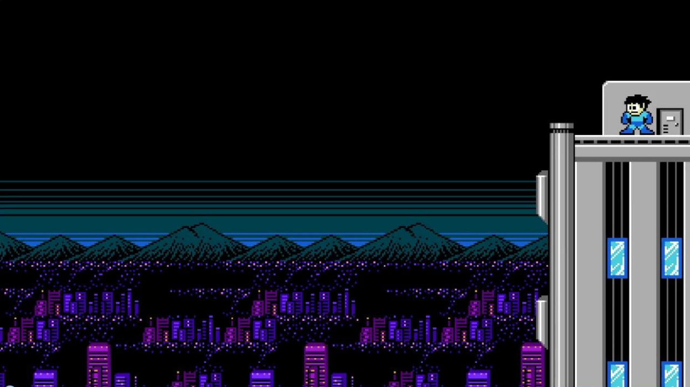
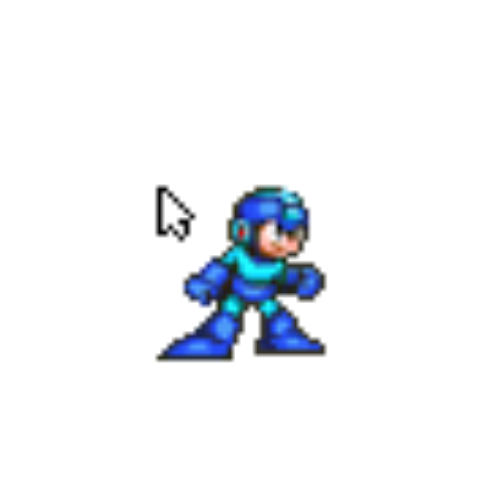

# Mega Man Memory Game


There's been a lot of debating and ideas for considering my Second project. After considering my options, I decided to create a memory game inspired by one of my favourite [Capcom](http://www.capcom-europe.com/) game franchise called "Mega Man," which is known as "Rockman" in Japan. 

The First time I played Mega Man 1, I was very addicted to the game, as I found it very entertaining, and the challenges on every stage of the game were worth playing it. 

The younger me always looked forward to the succeeding Mega Man game series. What I found interesting about the game is the theme of every robot bosses and their special powers. 

I put a lot of inspiration in creating this memory game. Whether you're a fan of Mega Man or have just heard of Mega Man, I hope this game entertains you! 

- [UX](#ux)
  * [Project Goals](#project-goals)
  * [User Goals](#user-goals)
  * [User Stories](#user-stories)
- [Wireframes](#wireframes)
- [Features](#features)
  * [How To Play The Game](#how-to-play-the-game)
  * [Start Text](#start-text)
  * [Timer](#timer)
  * [Flips](#flips)
  * [Music On/Off](#music-on-off)
  * [Win and Game Over Message](#win-and-game-over-message)
- [The Game Theme](#the-game-theme)
  * [The Game characters](#the-game-characters)
    + [[Mega Man](https://megaman.fandom.com/wiki/Mega_Man_(original_series) - Mega Man 1-5](#-mega-man--https---megamanfandomcom-wiki-mega-man--original-series----mega-man-1-5)
    + [[Guts Man](https://megaman.fandom.com/wiki/Guts_Man) - Mega Man 1](#-guts-man--https---megamanfandomcom-wiki-guts-man----mega-man-1)
    + [[Air Man](https://megaman.fandom.com/wiki/Air_Man) - Mega Man 2](#-air-man--https---megamanfandomcom-wiki-air-man----mega-man-2)
    + [[Snake Man](https://megaman.fandom.com/wiki/Snake_Man) - Mega Man 3](#-snake-man--https---megamanfandomcom-wiki-snake-man----mega-man-3)
    + [[Toad Man](https://megaman.fandom.com/wiki/Toad_Man) - Mega Man 4](#-toad-man--https---megamanfandomcom-wiki-toad-man----mega-man-4)
    + [[Gravity Man](https://megaman.fandom.com/wiki/Gravity_Man) - Mega Man 5](#-gravity-man--https---megamanfandomcom-wiki-gravity-man----mega-man-5)
  * [Back Card](#back-card)
    + [Mega Man Helmet Photo](#mega-man-helmet-photo)
  * [Game Background Photo](#game-background-photo)
  * [The Mega Man Logo](#the-mega-man-logo)
  * [Mega Man Cursor](#mega-man-cursor)
  * [The Game Music](#the-game-music)
    + [Start Game Music Background - Taken from the Title Screen (Mega Man 2).](#start-game-music-background---taken-from-the-title-screen--mega-man-2-)
    + [Card Picker - Is the sound when Mega Man jumps in his Mega Man games.](#card-picker---is-the-sound-when-mega-man-jumps-in-his-mega-man-games)
    + [Cards Match - Is the sound when Mega Man gets a Bonus ball.](#cards-match---is-the-sound-when-mega-man-gets-a-bonus-ball)
    + [Game Over - Is the sound when Mega Man gets defeated (Mega Man 4).](#game-over---is-the-sound-when-mega-man-gets-defeated--mega-man-4-)
- [Colour Theme](#colour-theme)
  * [Coolors Colour Palette:](#coolors-colour-palette-)
    + [Mega Man Image](#mega-man-image)
    + [Proto Man Image](#proto-man-image)
- [Fonts](#fonts)
- [Deployment](#deployment)
  * [Cloning Mega Man Memory Game from GitHub](#cloning-mega-man-memory-game-from-github)
- [Testing](#testing)
- [Technologies Used](#technologies-used)
  * [Languages Used](#languages-used)
- [Credits](#credits)
  * [Photos, Logo, Cursor, Music, Colour themes and Additional Information](#photos--logo--cursor--music--colour-themes-and-additional-information)
  * [Acknowledgements](#acknowledgements)
- [Site / Game Disclaimer](#site---game-disclaimer)

<small><i><a href='http://ecotrust-canada.github.io/markdown-toc/'>Table of contents generated with markdown-toc</a></i></small>


# UX 

## Project Goals

I wanted to create a memory card game for this project using a theme and characters that I felt inspired to use. After considering many options, I went for one of my all-time favourite game called “Mega Man.” Mega Man is a famous Capcom classic game, which is also known as Rockman in Japan. I was so drawn to creating a game inspired by the characters from Mega Man 1-5, that I chose 6 of them to be included in this memory card game. 

In addition, my goal in creating this game is:

* To attract users with the theme and look of the game.
* To create a game targeting Mega Man fans.
* To attract non-Mega Man fans to play the game.
* To create a 12 card memory game that includes 6 characters that can be found in Mega Man 1-5 game within 60 seconds.
* To inspire Mega Man fans like me to reminisce some of the characters of Mega Man 1-5.
* To attract different demographics to play the game.

## User Goals 

* Completing all the 12 memory cards.
* Completing the game within 60 seconds. 
* To remind Mega Man fans of the characters in Mega Man 1-5 games (Mega Man Fans).
* To have fun with the game. 
* To play a game that has a different theme (Especially non-Mega Man fans).

## User Stories

* To play a game that is fun, interactive, and conceptual. 
* To play a game that is inspired by one of the Classic games that bring memories.
* To play a game that uses characters that I am a fan of.
* To play a game that tests and challenges my memory skills within a timeframe. 
* To play a game that lets me play repeatedly.
* To play a game that I can use as my daily dose of brainpower.
* To play a game that provides me instructions on how to play it. 
* To play I game that works on a laptop, desktop, tablet, and mobile. 
* To control the music or sound at my convenience.

# Wireframes 

My wireframes were all created using [Balsamiq wireframes](https://balsamiq.com/). I’ve individually created wireframes for Desktop, Tablet, and Mobile versions. 

All my wireframes can be viewed here: [Wireframes](https://github.com/GlobetrotterG/mega-man-memory-game/tree/master/wireframes).

# Features

## How To Play The Game 

* The Mega Man Memory Game is a deck of 12 cards with using 6 characters. To play the game, the user must match 2 similar cards within 60 seconds to win the game. 
* For an additional challenge to the game, I added a number of flips to the game for the user to track the number of times they have turned a card. 

## Start Text 

* Before the game starts, a "Start Game" is displayed on the screen. 
* Once that's pressed, the game starts, with the background music playing on a loop and the timer starts counting.

## Timer 

* Timer has been set to 60 seconds to make the game more fun and challenging for the user. 

## Flips

* The number of flips feature was included in order for the user to assess the number of flips they've made within 60 seconds. 
* It's a fun feature to add as it challenges the user. 

## Music On/Off

* Is added for the user to control the music of the game and giving them the option to play the game with or without music. 
* This can be controlled by pressing the icon. 

## Win and Game Over Message

* If all 12 cards have been matched within 60 seconds, a "You win!" message comes out, and the game will restart once pressed. A sound effect can be heard.
* If all 12 cards have not been matched within 60 seconds, then a "Game Over!" comes out, and will restart once pressed. A sound effect can be heard.

# The Game Theme 

If this is the First time you've heard of the Mega Man game, you will ask yourself... Who is Mega Man?. 

As per [Wikipedia](https://en.wikipedia.org/wiki/Mega_Man#:~:text=In%20the%20story%20behind%20the,Dr.%20Wily%20as%20his%20partner.&text=After%20defeating%20a%20Robot%20Master,that%20Robot%20Master's%20special%20weapon.), here is a brief summary about Mega Man: 

>In the story behind the original series, Mega Man is a robot originally named Rock, created as a lab assistant by the scientist Dr. Light with Dr. Wily as his partner. Following treachery by Dr. Wily in which he reprogrammed most of Dr. Light's robots, Rock volunteered to be converted into a fighting robot to defend the world from Wily's violent robotic threats, thus becoming Mega Man.

>Though all incarnations of Mega Man feature unique stories, settings, and characters, they share several common features. All main Mega Man games released prior to 1997 are side-scrolling action platformers. The player character must fight through the levels using Mega Man's "Mega Buster"—a cannon attached to his arm—to shoot the robotic enemies inhabiting his environment. When Mega Man was released in 1987, the characteristic that made it revolutionary was the choice given to the player of which robot master to attempt first. After defeating a Robot Master—the boss of a level—Mega Man gains the ability to use that Robot Master's special weapon.

The First-ever [Mega Man 1](https://en.wikipedia.org/wiki/Mega_Man_(1987_video_game)) had so much influence on my love for the game, and have even downloaded a Mega Man game app on Google Play. 

This game uses inspiration from a selected 5 robot characters from Mega Man 1 - 5 and Mega Man himself to complete the deck of 12 chards for this game. The background music, sound effects, and backdrop for the game itself have all been inspired by the game itself. 

## The Game characters

### [Mega Man](https://megaman.fandom.com/wiki/Mega_Man_(original_series) - Mega Man 1-5

* Photo source link on [Clipartmax](https://www.clipartmax.com/middle/m2H7H7H7G6A0H7A0_mega-man-blue-video-game-character/)

### [Guts Man](https://megaman.fandom.com/wiki/Guts_Man) - Mega Man 1

* Photo source link on [favpng](https://favpng.com/png_view/magnet-toys-mega-man-7-mega-man-bass-mega-man-the-power-battle-mega-man-powered-up-png/fqyJN7L0)

### [Air Man](https://megaman.fandom.com/wiki/Air_Man) - Mega Man 2

* Photo source link on [favpng](https://favpng.com/png_view/mega-man-9-mega-man-2-street-fighter-x-mega-man-dr-wily-street-fighter-x-tekken-png/fq0DPtTx)

### [Snake Man](https://megaman.fandom.com/wiki/Snake_Man) - Mega Man 3

* Photo source link on [favpng](https://favpng.com/png_view/mega-sale-mega-man-3-mega-man-6-shadow-man-snake-png/QThL9Hyi)

### [Toad Man](https://megaman.fandom.com/wiki/Toad_Man) - Mega Man 4 

* Photo source link on [favpng](https://favpng.com/png_view/garbage-man-cartoon-mega-man-4-mega-man-2-mega-man-iv-mega-man-9-mega-man-3-png/Af6NvSkL)

### [Gravity Man](https://megaman.fandom.com/wiki/Gravity_Man) - Mega Man 5

* Photo source link on [Clipartmax](https://www.clipartmax.com/middle/m2i8m2i8N4A0H7K9_follow-mega-man-gravity-man/)

## Back Card
For the back card of the game, I used Mega Man's helmet as the picture which complimented the theme of the game.

### Mega Man Helmet Photo

* Photo source link on [Clipartmax](https://www.clipartmax.com/middle/m2i8N4N4H7K9G6d3_mega-man-10-proto-man-helmet-clip-art-draw-mega-mans-helmet/)

## Game Background Photo 
The background photo was taken from the Title screen in Mega Man 2. It compliments the game, and gives that Mega Man universe vibe. 

* Photo source link on [Wallpaperaccess](https://wallpaperaccess.com/mega-man)

## The Mega Man Logo

The Mega Man vector logo used was taken from a link called [Sprites-inc](http://sprites-inc.co.uk/thread-1889.html) from one of the site members called gaemon. 

To make it more immersive and relevant to the name of the Mega Man-themed memory game, I added the text "Memory Game." This was edited using [Canva](https://www.canva.com/). The text that was used is called "Squartiqa."

## Mega Man Cursor

On a Desktop and Laptop, I have added a Mega Man cursor to make the gaming experience more immersive and fun. The cursor can be found on 
[cursors-4u](http://www.cursors-4u.com/cursor/2009/02/17/mega-man-2.html)



## The Game Music

* Once the "Start Game" is pressed, the game begins with the background music played on a loop. 
* 4 other sound effects can be heard: 
    * When choosing a card
    * When 2 cards are match 
    * When it's Game Over 
    * When you win the game
* Selection of the music and sound effects have been carefully selected to compliment the game itself. For Mega Man fans, this will also reminisce their gaming experience when they are playing a Mega Man game. 

Music were downloaded from [khinsider](https://downloads.khinsider.com/game-soundtracks/album/megaman-2-original-soundtrack) and [101soundboards](https://www.101soundboards.com/boards/10834-mega-man-sounds).

### Start Game Music Background - Taken from the Title Screen (Mega Man 2). 
* Check the music link [here](https://downloads.khinsider.com/game-soundtracks/album/megaman-2-original-soundtrack/02%2520-%2520Title%2520Screen.mp3)

### Card Picker - Is the sound when Mega Man jumps in his Mega Man games. 
* Check the music link [here - Number 6](https://www.101soundboards.com/boards/10834-mega-man-sounds)

### Cards Match - Is the sound when Mega Man gets a Bonus ball.
* Check the music link [here - Number 26](https://www.101soundboards.com/boards/10834-mega-man-sounds)

### Game Over - Is the sound when Mega Man gets defeated (Mega Man 4). 
* Check the music link [here](https://downloads.khinsider.com/game-soundtracks/album/megaman-4-original-soundtrack/30%2520-%2520Game%2520Over.mp3)

# Colour Theme

* Choosing the colour theme for this game was mainly inspired from the colour palette's of both Mega Man and Proto Man characters. 
* Mega Man has elements of Blue, while Proto Man has elements of Red. 
* Colour palette for Mega Man was idea was taken from the color-hex link created by a user named [dunstontc](https://www.color-hex.com/color-palette/25174).
* Colour palette for Proto Man was idea was taken from a site called [diariesofanessexgirl](https://diariesofanessexgirl.com/retro-proto-man-color-palette/) and created by a user named [Joshua Margolin](https://diariesofanessexgirl.com/retro-proto-man-color-palette/).
* I've compiled all the colour palette ideas incorporated in the game from a site called [coolors](https://coolors.co/).

## Coolors Colour Palette:


### Mega Man Image


### Proto Man Image


# Fonts

I went for 2 fonts to compliment the theme of the game using [Google Fonts](https://fonts.google.com/). They are: 
* [Rubik Mono One](https://fonts.google.com/specimen/Rubik+Mono+One?query=rubik+mo) - For the Timer and Flip text.
* [Press Start 2P](https://fonts.google.com/specimen/Press+Start+2P?query=press+) - For the Start Game Text.

# Deployment

Mega Man Memory Game was developed on GitPod, using git and GitHub to host the repository.

When deploying Mega Man Memory Game using GitHub Pages, the following steps were made: 

* Opened up **GitHub** in the browser.
* Signed in using username and password. 
* Selected my **repositories**.
* Navigated to **'/GlobetrotterG/mega-man-memory-game'**.
* In the top navigation clicked **'settings'**.
* Scrolled down to the **GitHub Pages** area.
* Selected **'Master Branch'** from the **'Source'** dropdown menu.
* Clicked to confirm my selection. 
* Love Cebu! is now live on GitHub pages.

## Cloning Mega Man Memory Game from GitHub

* Navigate to **'/GlobetrotterG/mega-man-memory-game'**.
* Click the green **'Clone or Download'** button.
* Copy the url in the dropdown box. 
* Using your favourite **IDE,** open up your preferred **terminal**. 
* Navigate to your desired file location. 
* Copy the following **code** and input it into your terminal to clone Love Cebu! 

```
git clone: https://github.com/GlobetrotterG/mega-man-memory-game.git
```

# Testing 

* Site was coded using a Dell XPS 13 laptop and also used it to test website responsiveness on laptop.
* Mobile site version was tested using an iphone 7 Plus, Samsung Galaxy S10+, Google Pixel 3a XL phones. 
* Tablet site version was tested on an ipad Air.
* To test overall website responsiveness for Laptop, Desktop, Mobile and Tablet, I also used Google Chrome DevTools.
* HTML code was tested using [W3C Markup Validation Service](https://validator.w3.org/)
* CSS code was tested using [W3C CSS Markup Validation Service - Jigsaw](https://jigsaw.w3.org/css-validator/)
* JavaScript code was tested using [JSHint](https://jshint.com/)

# Technologies Used

## Languages Used

* HTML 
* CSS 
* JavaScript

Tools and Libraries
* Chrome Developer Tools
* Google Fonts 
* Bootstrap
* GitPod
* GitHub
* Font-Awesome

# Credits

## Photos, Logo, Cursor, Music, Colour themes and Additional Information

* For the the photos, cursor and logo used in this project, including the editing of it, I want to give credit to the following: 
    * [Clipartmax](https://www.clipartmax.com/)
    * [favpng](https://favpng.com/)
    * [Canva](https://www.canva.com/)
    * [Sprites-inc](http://sprites-inc.co.uk/)
    * [Wallpaperaccess](https://wallpaperaccess.com/mega-man)
    * [cursors-4u](http://www.cursors-4u.com/cursor/2009/02/17/mega-man-2.html)

* For the Music and Sound effects, I want to give credit to the following: 
    * [khinsider](https://downloads.khinsider.com/)
    * [101soundboards](https://www.101soundboards.com/)

* For the Colour themes, I want to give credit to the following: 
    * [color-hex](https://www.color-hex.com/)
    * [diaries of an essex girl](https://diariesofanessexgirl.com/)
    * [Coolors](https://coolors.co/)

* I used [Coolors](https://coolors.co/) to remove the background on the character's photos.

* For the additional information provided here in README for the backstory of Mega Man and the Robot characters, I want to give credit to the following: 
    * [Wikipedia](https://en.wikipedia.org/)
    * [Fandom](https://www.fandom.com/)

## Acknowledgements

I want to extend my biggest gratitude to the following: 

* Once again, I want to thank my amazing mentor, [Simen Daehlin](www.github.com/Eventyret), whose been very inspiring and motivsting throughout this project. This was one of the most challenging projects I've faced, but he gave me the "You can do it!" mindset. Fast forward, and now I am able to create this project with his motivation. Thank you, Simen! 
* I also want to thank the Code Institute community via Slack. We have such an amazing group who shares the same passion and interest in what we do! The guys in Slack have been very helpful with any questions I may have, or any students who may have similar questions to me.  
* I want to thank [Capcom](http://www.capcom-europe.com/) for creating a game that made waves in the games industry. Without their creation of the Mega Man game, I would have not been able to draw inspiration in creating this project! 

Throughout the behind-the-scenes in creating this project, and having a lot of experimenting and checking what works for this project, I want to thank these contents and developers who are masters of their crafts in the world of Software development, as I've drawn inspiration and insights for this project: 
* [How To Code A Card Game In Plain JavaScript - Spooky Halloween Edition by PortEXE](https://www.youtube.com/watch?v=3uuQ3g92oPQ)
* [Memory Card Game - JavaScript Tutorial by freecodecamp.org](https://www.youtube.com/watch?v=ZniVgo8U7ek&t=876s)
* [How to Code a Card Matching Game](https://www.youtube.com/watch?v=28VfzEiJgy4&t=168s)


# Site / Game Disclaimer 

* This game site and its contents were created for educational purposes. No Copyright infrigement intended to [Capcom](http://www.capcom-europe.com/).